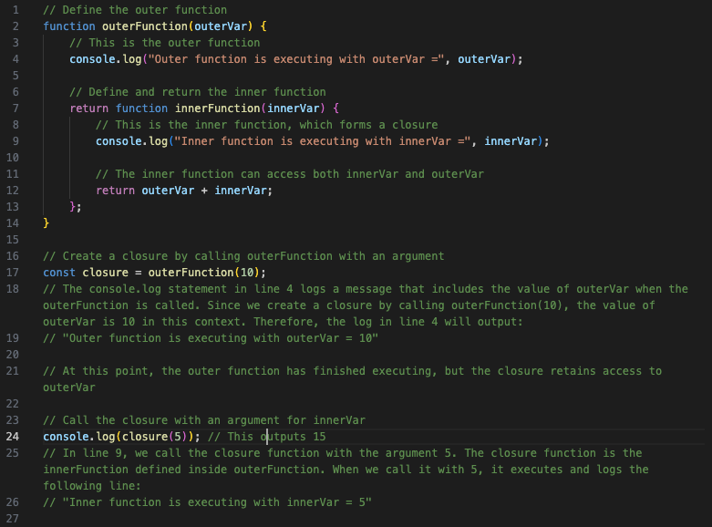
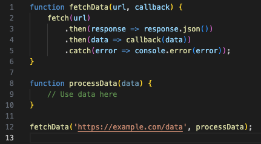
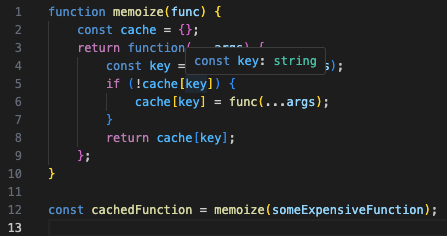

# JavaScript Closures Tutorial

## Introduction

Welcome to the JavaScript closures tutorial! In this tutorial, you'll dive into the fascinating world of CLOUSERS and learn how they work in JavaScript. Closures are a fundamental concept that every web developer should understand, as they play a crucial role in many aspects of JavaScript development.

## Summary

Summary
Closures are a mechanism in JavaScript that allow inner functions to access the variables and scope of their outer function even after the outer function has finished executing. They are an essential part of creating private variables and maintaining state within functions.
For Example:

## Table of Contents

- [Understanding Functions](#understanding-functions)
- [Nested Functions](#nested-functions)
- [Lexical Scope](#lexical-scope)
- [Practical Use Cases](#practical-use-cases)
- [Limitations of Closures](#limitations-of-closures)

## Closure Concepts and Components

### Understanding Functions

In this section, we will explore the basic concepts of JavaScript functions. We'll discuss function declarations, function expressions, and the concept of function scope. This understanding is crucial for grasping closures.

A closure in JavaScript is created when a function retains access to its outer (enclosing) function's variables, even after the outer function has completed execution. The key components of a closure include:

Outer Function (Enclosing Function): The outer function is the function that contains the inner function. It creates a local scope that the inner function can access.

Inner Function: The inner function is defined inside the outer function. It has access to the outer function's scope, including its variables and parameters.

Outer Function Variables: Closures allow the inner function to "capture" or "close over" the variables and parameters of the outer function. These variables become part of the closure's scope and can be used by the inner function, even after the outer function has completed its execution.

    - Function Declarations: A function declaration defines a named function that can be used before it is declared in the code. Function declarations are hoisted, which means they are moved to the top of their containing scope during the execution phase, making them accessible throughout the entire scope. Here's the syntax for a function declaration:

    - Function Expressions: A function expression defines an anonymous function and assigns it to a variable or property. Function expressions are not hoisted, meaning they can only be used after they have been defined in the code. Function expressions provide flexibility in creating anonymous functions and are often used in callbacks and as arguments to other functions. Here's the syntax for a function expression:
    

    - Function Scope: It is the visibility of variables declared within a function. Variables declared within a function are typically accessible only within that function, and they are said to have function scope and they are not visible or accessible outside the function in which they are defined.

### Nested Functions

Closures often involve nested functions. In this section, we will delve into the concept of nested functions and how they create closures. We'll also explain how inner functions "remember" their outer function's variables.

Nested functions, also known as inner functions, are functions defined within the body of another function. In JavaScript, you can create functions inside other functions, and these inner functions are referred to as nested functions. They have access to the scope of their containing (outer) function, which means they can access the variables and parameters of the outer function. Nested functions are often used for various purposes, such as:

    - Encapsulation: You can encapsulate code and variables within a function, making them private and not accessible from outside the function.

    - Modularity: Nested functions help break down complex tasks into smaller, more manageable units of code.

    - Closure Creation: Closures are created when an inner function accesses variables from its containing function, and nested functions play a central role in closures.

Here's a basic example of nested functions:

### Lexical Scope

To truly understand closures, you need to understand lexical scope. We'll explore how JavaScript determines the scope of variables and how it affects closures. It is a concept that determines how variables are accessed and resolved based on their location in the source code. In lexical scope, the scope of a variable is defined by its position in the source code and the nesting of functions, irrespective of how or when the code is executed. Key characteristics of lexical scope:

    - Variable Access: In lexical scope, when you reference a variable, the JavaScript engine looks for the variable in the nearest enclosing scope. If it doesn't find the variable there, it continues to the next outer scope until it reaches the global scope. This process is based on the structure of the code, not the order of execution.

    - Closure Creation: Lexical scope is crucial for creating closures in JavaScript. A closure is formed when an inner function (nested function) accesses variables from its containing (outer) function. The inner function "closes over" the variables in its lexical scope, retaining access to them even after the outer function has finished executing.

Here's an example to illustrate lexical scope:

### Practical Use Cases

Closures are a powerful and versatile concept. In this section, we'll showcase real-world examples where closures are used to solve common programming problems.

    - Data Encapsulation and Information Hiding: Closures can be used to create private variables and methods within an object. By encapsulating data and functionality, you can prevent direct access and modification of internal properties. This is crucial for building secure and maintainable code.

    - Module Pattern: Closures enable the creation of modules in JavaScript, allowing you to organize related functions and variables into a single reusable unit. This helps prevent global namespace pollution and promotes modularity in your code.

    - Callback Functions: Closures are frequently used in callback functions, such as event handlers, AJAX requests, and timeouts. The inner function maintains access to variables from its containing function even after the outer function has completed execution.

    - Partial Function Application: Closures can be used to create partially applied functions. This is helpful when you want to fix some arguments of a function and create a new function with the remaining arguments.

    - Memoization: Closures can be used to implement memoization, a technique for optimizing expensive function calls by caching their results based on input arguments.

### Limitations of Closures

While closures are powerful and useful in JavaScript, they come with some limitations and considerations:

    - Memory Usage: Closures can potentially lead to increased memory usage because the variables from the outer function are retained even after the outer function has finished executing. If not used carefully, this can result in memory leaks.

    - Performance Impact: Closures can have a slight impact on performance because the JavaScript engine needs to keep track of the variables in the closure scope.

    - Variable Updates: Closures capture variables by reference, not by value. This means that if you modify a closed-over variable from an outer function, the change is reflected in the closure. This can sometimes lead to unexpected behavior.

    - Nested Closures: Using multiple nested closures can make the code more complex and harder to understand. It's essential to strike a balance between using closures for their benefits and avoiding overuse.

    - Garbage Collection: Understanding when closures are eligible for garbage collection (i.e., when they no longer have references) can be tricky. Failing to release closures when they are no longer needed can lead to memory issues.

To use closures effectively and avoid their limitations, it's important to be mindful of memory management, variable scope, and the potential impact on performance when designing your JavaScript applications.

## Author

This tutorial was written by Ricardo Behrens. Ricardo is currently a web developer and full stack bootcamp student working his way through modules and classes three times a week. You can find more of Ricardo's work on [rickybehrens](https://github.com/rickybehrens) and if you would like to email him, please do so at [behrensricardo@gmail.com](mailto:behrensricardo@gmail.com).
